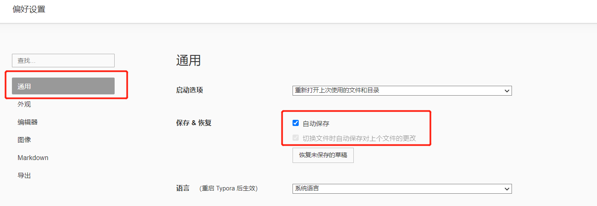
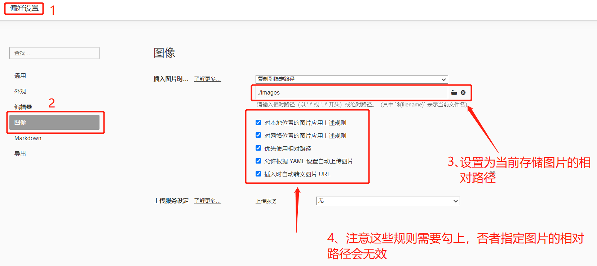
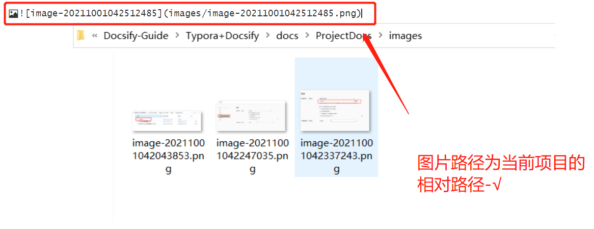

# Typora+Docsify快速入门

## Typora是什么？

​	Typora中文版是一款好用极简免费的跨平台Markdown编辑器，软件使用这款软件能够帮助用户轻松将文本转换到HTML，软件从底层向上设计，软件支持markdown的标准语法，同时这款软件还支持动态预览功能，一键预览，让一切都变得如此干净、纯粹。

## Typora中文网

https://www.typora.net/

## Typora下载地址

https://typora.io/#download

## Typora相关主题

https://www.typora.net/themes/

## Markdown是什么？

>  Markdown 是一种轻量级标记语言，它允许人们使用易读易写的纯文本格式编写文档，Markdown文件的后缀名便是“.md”。	

​	Markdown是一种轻量级标记语言，排版语法简洁，让人们更多地关注内容本身而非排版。它使用易读易写的纯文本格式编写文档，可与HTML混编，可导出 HTML、PDF 以及本身的 .md 格式的文件。因简洁、高效、易读、易写，Markdown被大量使用，如Github、Wikipedia等网站，如各大博客平台：WordPress、Drupal、简书等。

## Markdown 基本语法

> 在使用Typora之前首先你的先熟悉一下Markdown的基本语法，这样你用起Typora才能更加顺手、写起文章来更加快。

[Markdown 官方教程](https://markdown.com.cn/)

## Typora快捷键的使用

> 使用快捷键能够提高我们的开发，编辑效率，因此对于工具的快捷键灵活操作而言是十分重要的。

新建:  **CTRL + `N`**

保存: **CTRL  + `S`**

另存为: **CTRL + SHIFT + `S`**

段落：**CTRL+`0`**

一级标题: **CTRL + `1`**  这个是1级标题，最大的字号

二级标题: **CTRL + `2`** 

三级标题: **CTRL + `3`** 

四级标题 : **CTRL + `4`** 

五级标题 : **CTRL + `5`** 

六级标题 : **CTRL +`6`** 

插入表格: **CTRL + `T`**

插入引用: **CTRL + SHIFT + `Q`**

有序列表: **CTRL + SHIFT +` [`**

无序列表: **CTRL + SHIFT + `]`**

代码块: **CTRL + SHIFT + `K`** 

字体加粗: **CTRL + `B`** 

超链接:  **CTRL +` K`**

插入图片: **CTRL + SHIFT +` l`**

显示/隐藏侧边栏: **CTRL + SHIFT + `L`**

打开/关闭源代码模式: **CTRL +` /`**

全文查找: **CTRL + `F`**

全文替换: **CTRL + `H`**

开发者工具: **SHIFT + ` F12`**

跳转到文首 **CTRL + `Home`**

跳转到文末  **CTRL + `End`**

注：上面跳转文首、文末 HOME键 和 End键位置：（右边上下左右键的 上方有6个键，中间2个就是Home和End键）。

## 设置打开Typora依旧打开上次编辑的文件和目录

## Typora-自动保存

> 为了避免电脑意外关闭而导致辛苦编写的内容未保存丢失我们可以设置自动保存，避免电脑或者Typora意外关闭的情况。

## Typora配置图片保证在Docsify中能够正常访问

> 一般情况下为了保证项目中的图片在不同的平台中都能够正常的访问到，我们通常都是使用相对路径去存储，因此在Typora中我们需要设置图片保存的路径为当前项目的指定文件夹下。

**在Typora中可以直接通过Ctrl+V将图片复制保存到指定的项目文件夹位置中，使用相对路径可访问！**

### 设置如下

首先当前我们文件夹所处位置是在ProjectDocs文件夹目录里面，所以我们在ProjectDocs中新建images文件夹来存储文件图片。

### 文件=》偏好设置=》图像

### 设置图片保存的相对路径

### 将图片粘贴到Typora中查看效果

> 图片保存成功

## 参考文章

* [Typora 中的图像](https://support.typora.io/Images/#when-insert-images)
* [快速上手Typora](https://juejin.cn/post/6898943126480781319#)
* [Typora使用问题](https://www.typora.net/tag/typora%e4%bd%bf%e7%94%a8/)

